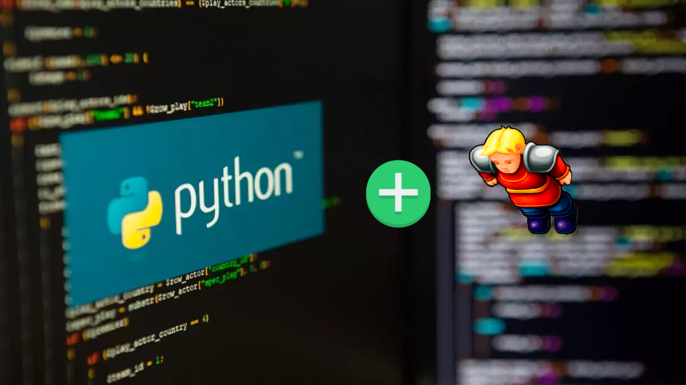

# Introdução à Programação Orientada a Objetos (POO)

## O que é Programação Orientada a Objetos (POO)?

A Programação Orientada a Objetos (POO) é um paradigma de programação que se baseia na organização do código em torno de objetos, unidades que representam entidades do mundo real. Esses objetos têm características (atributos) e comportamentos (métodos) que interagem entre si, proporcionando uma abordagem modular e eficiente para o desenvolvimento de software.

## História da POO

A programação orientada a objetos surgiu como uma alternativa a características da programação estruturada. O intuito da sua criação também foi o de aproximar o manuseio das estruturas de um programa ao manuseio das coisas do mundo real, daí o nome "**objeto**" como um algo genérico, que pode representar qualquer coisa tangível.

A verdadeira popularização da POO ocorreu nos anos 1980, com linguagens como Smalltalk e C++. Smalltalk foi pioneira na implementação efetiva de conceitos de POO, enquanto C++ trouxe a abordagem orientada a objetos para a linguagem de programação C, ganhando ampla aceitação na indústria.

Desde então, a POO tornou-se um paradigma essencial no desenvolvimento de software, influenciando linguagens como Python, Java e C#, proporcionando uma maneira mais modular, flexível e eficiente de organizar o código.

## Vantagens da POO

A POO oferece diversas vantagens, incluindo:

1. **Reutilização de Código:** A capacidade de reutilizar classes e objetos em diferentes partes do código, economizando tempo e esforço.

2. **Organização Estruturada:** A estrutura orientada a objetos facilita a organização e manutenção do código, tornando-o mais compreensível e escalável.

3. **Encapsulamento e Segurança:** O encapsulamento protege os detalhes de implementação, prevenindo acesso não autorizado e melhorando a segurança do código.

4. **Herança e Polimorfismo:** A herança permite criar novas classes com base em classes existentes, promovendo a reutilização de código. O polimorfismo permite que objetos de diferentes tipos sejam tratados de maneira uniforme.

## História do Tibia

O Tibia é um jogo online de role-playing que remonta a 1997, desenvolvido pela CipSoft. Ambientado em um mundo medieval e mágico, o Tibia permite que jogadores explorem, realizem missões, lutem contra criaturas e interajam em um ambiente multiplayer.

## Por que usar o Tibia neste Projeto?

O uso de exemplos inspirados no Tibia neste projeto tem o intuito de tornar o aprendizado da POO mais envolvente e prático. O universo do Tibia oferece uma variedade de entidades, como jogadores, criaturas e itens, que podem ser modeladas e manipuladas utilizando os conceitos de POO. Além disso, o Tibia é uma referência familiar para muitos, tornando o aprendizado mais acessível e interessante.

Ao explorar os princípios da POO através de exemplos do Tibia, os leitores têm a oportunidade de aplicar os conceitos de forma tangível, proporcionando uma experiência de aprendizado mais cativante e aplicável no desenvolvimento de aplicações do mundo real.

