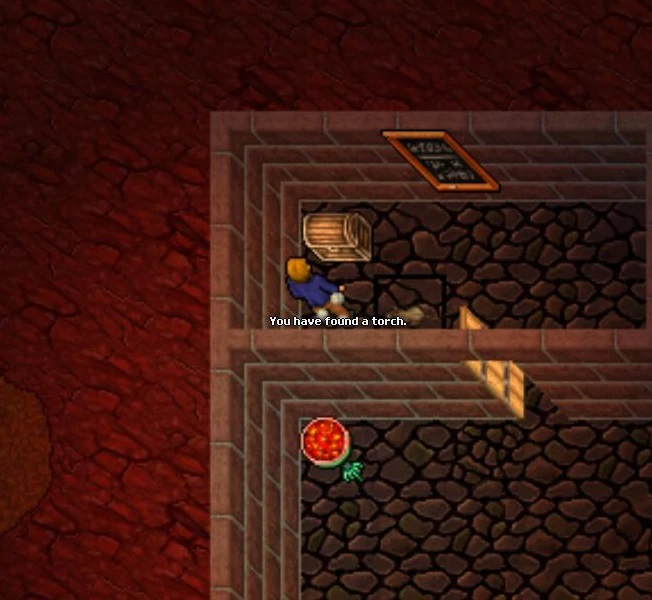

# Implementação Prática I - Criando Objetos

Nesta seção, vamos explorar a criação completa de objetos do Tibia em Python, aplicando os princípios dos quatro pilares da Programação Orientada a Objetos (POO): **Encapsulamento**, **Herança**, **Polimorfismo** e **Abstração**.

Vamos considerar a mesma **Torch** que utilizamos na página anterior, porém agora, aplicando conceitos adicionais para tornar a implementação mais completa e aderente aos princípios da POO.


Primeiramente, vamos criar uma classe base para representar todos os objetos do Tibia. Esta classe será chamada de **Item**:

```python
class Item:
    def __init__(self, nome, peso):
        self.nome = nome
        self.peso = peso
```

A classe **Item** possui dois atributos: **nome** e **peso**. O atributo **nome** representa o nome do item, e o atributo **peso** representa o peso do item. Ambos são inicializados através do método `__init__`, que recebe dois parâmetros: **nome** e **peso**. O método `__init__` é chamado sempre que um objeto é criado a partir de uma classe, e é responsável por inicializar os atributos do objeto.

O item também possui um método chamado `__str__`, que retorna uma string contendo o nome e o peso da tocha, simulando a ação "**View Item**":

```python
    def __str__(self):
        return f"You see a {self.nome}. It weighs {self.peso} oz."
```

A classe **Item** completa ficará assim:

```python
class Item:
    def __init__(self, nome, peso):
        self.nome = nome
        self.peso = peso

    def __str__(self):
        return f"You see a {self.nome}. It weighs {self.peso} oz."
```

Agora podemos criar a classe **Torch**, que representa a tocha do Tibia:

```python
class Torch(Item):
    def __init__(self, nome, peso, acesa=False):
        super().__init__(nome, peso)
        self._acesa = acesa  # Utilizando encapsulamento com o underscore _

    def acende(self):
        if not self._acesa:
            print(f"A tocha foi acesa.")
            self._acesa = True
        else:
            print("A tocha já está acesa.")

    def apaga(self):
        if self._acesa:
            print(f"A tocha foi apagada.")
            self._acesa = False
        else:
            print(f"A tocha já está apagada.")
```

A classe **Torch** herda da classe **Item**, pois uma tocha é um item. 

A classe **Torch** possui três atributos: **nome**, **peso** e **acesa**. Os atributos **nome** e **peso** são herdados da classe **Item**, e o atributo **acesa** é inicializado através do método `__init__`, que recebe três parâmetros: **nome**, **peso** e **acesa**. 

O atributo **acesa** é inicializado com o valor `False` por padrão, mas pode ser alterado para `True` através do método `acende`, que altera o valor do atributo **acesa** para `True` e imprime uma mensagem informando que a tocha foi acesa. O método `acende` também verifica se a tocha já está acesa, e caso esteja, imprime uma mensagem informando que a tocha já está acesa. O método `apaga` funciona de forma análoga ao método `acende`, porém altera o valor do atributo **acesa** para `False` e imprime uma mensagem informando que a tocha foi apagada.

Além disso ela também tem um "**tempo de vida**", que é o tempo que ela permanece acesa. Para isso, vamos criar um atributo chamado **tempo_de_vida** e um método chamado `diminui_tempo_de_vida`, que é ativado ao acender a tocha e ao passar do tempo vai diminuindo o tempo de vida da tocha. Quando o tempo de vida da tocha chegar a 0, ela se apaga automaticamente.

```python
import time
class Torch(Item):
    def __init__(self, nome, peso, acesa=False):
        super().__init__(nome, peso)
        self._acesa = acesa
        self._tempo_de_vida = 300 # Tempo de vida da tocha em segundos (5 minutos)

    def acende(self):
        if not self._acesa:
            print(f"A tocha foi acesa.")
            self._acesa = True
        else:
            print("A tocha já está acesa.")

    def diminui_tempo_de_vida(self):
        while self._acesa and self._tempo_de_vida > 0:
            time.sleep(10)  # Diminui o tempo de vida da tocha a cada 10 segundos acesa
            self._tempo_de_vida -= 10
            if self._tempo_de_vida <= 0:
                self.apaga()
```

Ainda não está perfeito, pois se a tocha for acesa e o método `diminui_tempo_de_vida` não for chamado, a tocha permanecerá acesa para sempre. Além disso como o método `diminui_tempo_de_vida` é um loop infinito, ele não permite que outros métodos sejam chamados enquanto a tocha estiver acesa. Para resolver isso, vamos utilizar o conceito de **Thread**.

>Uma thread é uma sequência de instruções que pode ser executada simultaneamente com outras sequências de instruções. Em Python, podemos criar uma thread utilizando a classe `Thread` do módulo `threading`.

```python
import time
from threading import Thread

def acende(self):
        if not self._acesa:
            print(f"A tocha foi acesa.")
            self._acesa = True
            Thread(target=self.diminui_tempo_de_vida).start()
        else:
            print("A tocha já está acesa.")

def diminui_tempo_de_vida(self):
        while self._acesa and self._tempo_de_vida > 0:
            time.sleep(10)
            self._tempo_de_vida -= 10
            if self._tempo_de_vida <= 0:
                self.apaga()
```

Agora, quando a tocha for acesa, o método `diminui_tempo_de_vida` será executado em uma thread separada, permitindo que outros métodos sejam chamados enquanto a tocha estiver acesa.

Por último a classe **Torch** completa ficará assim:

```python
import time
from threading import Thread

class Torch(Item):
    def __init__(self, nome, peso, acesa=False):
        super().__init__(nome, peso)
        self._acesa = acesa
        self._tempo_de_vida = 300

    def acende(self):
        if not self._acesa:
            print(f"A tocha foi acesa.")
            self._acesa = True
            Thread(target=self.diminui_tempo_de_vida).start()
        else:
            print("A tocha já está acesa.")

    def apaga(self):
        if self._acesa:
            print(f"A tocha foi apagada.")
            self._acesa = False
        else:
            print(f"A tocha já está apagada.")

    def diminui_tempo_de_vida(self):
        while self._acesa and self._tempo_de_vida > 0:
            time.sleep(10)
            self._tempo_de_vida -= 10
            if self._tempo_de_vida <= 0:
                self.apaga()
                print("A tocha se esgotou.")
    
    def __str__(self):
        return f"You see a {self.nome}. It weighs {self.peso} oz."
```

Pronto! Agora temos uma tocha completa, com todos os conceitos da POO aplicados. Vamos testar a tocha:



- Criando a tocha
```python
tocha = Torch('Torch', 5)
```
- Verificando o nome e o peso da tocha
```python
print(tocha)
# Saída: You see a Torch. It weighs 5 oz.
```

- Acendendo a tocha
```python
tocha.acende()
# Saída: A tocha foi acesa.
```

- Apagando a tocha
```python	
tocha.apaga()
# Saída: A tocha foi apagada.
```

- Mantendo a tocha acesa por 5 minutos até ela se apagar automaticamente
```python
tocha.acende()
# Saída: A tocha foi acesa.
# Após 5 minutos:
# Saída: A tocha foi apagada.
```

Perceba que a tocha se apagou automaticamente após 5 minutos, pois o tempo de vida dela chegou a 0.

>Para praticar, tente implementar outros objetos do Tibia utilizando os conceitos da POO. Você pode utilizar a [TibiaWiki](https://www.tibiawiki.com.br/wiki/Itens) como referência para os atributos e métodos dos objetos.


### Próxima Leitura:
[3 - Implementação Prática II - Criando a Classe Criatura](3%20-%20Implementação%20Prática%20II%20-%20Criando%20a%20Classe%20Criatura.md)