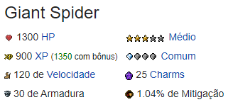
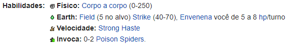
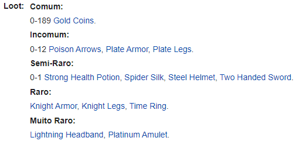
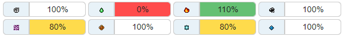
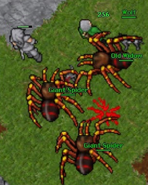

# Implementação Prática II - Criando a Classe Criatura

Agora que já foi apresentado com mais detalhes os conceitos de POO, vamos criar a classe **Criatura**. Essa classe será responsável por criar os criaturas que o jogador irá enfrentar durante o jogo.

A partir da página de qualquer criatura no Tibia Wiki, podemos obter algumas informações de quais serão os atributos da classe **Criatura**. 

Nessa implementação prática, vamos replicar a temida **Giant Spider**. 

Acessando sua página no [Tibia Wiki](https://www.tibiawiki.com.br/wiki/Giant_Spider) podemos ver que ela possui os seguintes atributos básicos:



Assim como informações sobre suas **resistencias**, **imunidades**, **habilidades** e **loot**.

Portanto a nossa classe **Criatura** completa terá os seguintes atributos:

- `nome`: Nome da criatura.
- `hp`: Quantidade de vida da criatura.
- `dificuldade`: Dificuldade da criatura.
- `exp`: Quantidade de experiência que o jogador ganha ao derrotar a criatura.
- `ocorrencia`: Probabilidade da criatura aparecer durante o jogo.
- `velocidade`: Velocidade de movimento da criatura.
- `armadura`: Armadura da criatura.
- `mitigacao`: Mitigação de dano da criatura.
- `habilidades_dano`: Habilidades de dano da criatura.
- `habilidades_cura`: Habilidades de cura da criatura.
- `habilidades_especiais`: Habilidades especiais da criatura.
- `loot`: Loot que a criatura pode dropar ao ser derrotado e suas respectivas probabilidades.
- `resistencias`: Resistencias da criatura a determinados tipos de dano.
- `imunidades`: Imunidades da criatura a certos efeitos.
- `pode_ser_puxado`: Indica se a criatura pode ser puxado pelo jogador.
- `empurra_objetos`: Indica se o criatura pode empurrar objetos.
- `passa_por`: Indica se o criatura pode passar por alguns tipos de campos.
  

## Criando a classe Criatura

Antes de criar a classe **Criatura**, vamos criar as classes **Habilidade**, **Loot** e **Resistencias**. Essas classes serão usadas para criar os atributos `habilidades`, `loot` e `resistencias` da classe **Criatura**.

### Criando a classe Habilidade

Vamos analisar as habilidades da **Giant Spider**, e abstrair os atributos que serão necessários para criar as classes **HabilidadeDano**, **HabilidadeCura** e **HabilidadeEspecial**.



A classe **HabilidadeDano** terá os seguintes atributos:

- `nome`: Nome da habilidade.
- `descricao`: Descrição da habilidade.
- `tipo`: Tipo da habilidade.
- `mana`: Quantidade de mana necessária para usar a habilidade.
- `dano_min`: Dano mínimo da habilidade.
- `dan_max`: Dano máximo da habilidade.
- `dano_dot`: Dano por turno da habilidade.
- `duracao_dot`: Duração do dano por turno.

Algumas criaturas possuem habilidades de cura ou habilidades especiais como sumonar criaturas, aumentar a velocidade, etc. Portanto, vamos criar as classes **HabilidadeCura** e **HabilidadeEspecial**.

A classe **HabilidadeCura** terá os seguintes atributos:

- `nome`: Nome da habilidade.
- `descricao`: Descrição da habilidade.
- `mana`: Quantidade de mana necessária para usar a habilidade.
- `cura`: Quantidade de vida que a habilidade pode curar.

A classe **HabilidadeEspecial** terá os seguintes atributos:

- `nome`: Nome da habilidade.
- `descricao`: Descrição da habilidade.
- `mana`: Quantidade de mana necessária para usar a habilidade.


Levantando esses atributos, podemos criar as classes **HabilidadeDano**, **HabilidadeCura** e **HabilidadeEspecial** em Python.

A classe **HabilidadeDano** completa ficará da seguinte forma:

```python
import time

from typing import Optional
from random import randint


class HabilidadeDano:
    def __init__(
        self,
        nome: str,
        descricao: str,
        tipo: str,
        mana: int,
        dano_min: Optional[int] = None,
        dano_max: Optional[int] = None,
        dano_dot: Optional[int] = None,
        duracao_dot: Optional[int] = None,
        intervalo_dot: Optional[int] = 2,
    ):
        self.nome = nome
        self.descricao = descricao
        self.tipo = tipo
        self.mana = mana
        self.dano_min = dano_min
        self.dano_max = dano_max
        self.dano_dot = dano_dot
        self.duracao_dot = duracao_dot
        self.intervalo = intervalo_dot

    def spell_ataque(self, alvo):
        dano = randint(self.dano_min, self.dano_max)
        alvo.hp -= dano
        print(f"{alvo.nome} recebeu {dano} pontos de dano.")

    def spell_dot(self, alvo):
        alvo.hp -= self.dano_dot
        time.sleep(self.intervalo)
        print(f"{alvo.nome} recebeu {self.dano_dot} pontos de dano.")
        self.duracao_dot -= self.intervalo
        if self.duracao_dot <= 0:
            print(f"O efeito de {self.nome} acabou.")
        return

    def __str__(self):
        return self.nome
```

A classe **HabilidadeCura** completa ficará da seguinte forma:

```python
class HabilidadeCura:
    def __init__(self, nome: str, descricao: str, mana: int, cura: int):
        self.nome = nome
        self.descricao = descricao
        self.mana = mana
        self.cura = cura

    def spell_cura(self, alvo):
        alvo.hp += self.cura
        print(f"{alvo.nome} recebeu {self.cura} pontos de cura.")

    def __str__(self):
        return self.nome
```

A classe **HabilidadeEspecial** completa ficará da seguinte forma:

```python
from models.Criatura import Criatura

class HabilidadeEspecial:
    def __init__(self, nome: str, descricao: str, mana: int, efeito: callable):
        self.nome = nome
        self.descricao = descricao
        self.mana = mana

    def aumentar_velocidade(self, alvo):
        alvo.velocidade += self.velocidade + (self.velocidade * 0.7 - 28)
        print(f"{alvo.nome} teve sua velocidade aumentada.")
    
    def summonar_criaturas(self, quantidade: int, criatura: Criatura):
        minions = []
        for i in range(quantidade):
            minions.append(criatura)
        print(f"{quantidade} {criatura.nome} summonada(s).")
        return minions

    def __str__(self):
        return self.nome
```

### Criando a classe Loot

Vamos analisar como os loots da **Giant Spider** são apresentados no Tibia Wiki.



A partir da imagem acima, podemos criar classe **Loot** com os seguintes atributos:

- `nome`: Nome do loot.
- `quantidade`: Quantidade do loot.
- `chance`: Chance do loot ser dropado.

A classe **Loot** completa ficará da seguinte forma:

```python
class Loot:
    def __init__(self, nome: str, quantidade: int, chance: float):
        self.nome = nome
        self.quantidade = quantidade
        self.chance = chance

    
    def __str__(self):
        return self.nome
```

### Criando a classe Resistencias

Os criaturas do Tibia possuem resistências a determinados tipos de dano. Vamos analisar as resistências da **Giant Spider**.



A classe **Resistencias** terá os seguintes atributos:

- `fisico`: Porcentagem de dano físico recebido.
- `fogo`: Porcentagem de dano de fogo recebido.
- `gelo`: Porcentagem de dano de gelo recebido.
- `morte`: Porcentagem de dano de morte recebido.
- `energia`: Porcentagem de dano de energia recebido.
- `sagrado`: Porcentagem de dano sagrado recebido.
- `terra`: Porcentagem de dano de terra recebido.
- `cura`: Porcentagem de cura recebida.

A classe **Resistencias** completa ficará da seguinte forma:

```python
class Resistencia:
    def __init__(self, fisico: int, fogo: int, gelo: int, morte: int, energia: int, sagrado: int, terra: int, cura: int):
        self.fisico = fisico
        self.fogo = fogo
        self.gelo = gelo
        self.morte = morte
        self.energia = energia
        self.sagrado = sagrado
        self.terra = terra
        self.cura = cura
```

Agora que já criamos as classes **Habilidade**, **Loot** e **Resistencia**, podemos criar a classe **Criatura** e atribuir os tipos de dados para cada atributo.

### Criando a classe Criatura

```python
from random import random
from typing import List

from classes.HabilidadeDano import HabilidadeDano
from classes.HabilidadeCura import HabilidadeCura
from classes.HabilidadeEspecial import HabilidadeEspecial
from classes.Loot import Loot
from classes.Resistencia import Resistencia


class Criatura:
    def __init__(
        self,
        nome: str,
        hp: int,
        dificuldade: str,
        exp: int,
        ocorrencia: str,
        velocidade: int,
        armadura: int,
        mitigacao: float,
        habilidades_dano: List[HabilidadeDano],
        habilidades_cura: List[HabilidadeCura],
        habilidades_especiais: List[HabilidadeEspecial],
        loot: List[Loot],
        resistencias: Resistencia,
        imunidades: List[str],
        pode_ser_puxado: bool,
        empurra_objetos: bool,
        passa_por: List[str],
    ):
        self.nome = nome
        self.hp = hp
        self.dificuldade = dificuldade
        self.exp = exp
        self.ocorrencia = ocorrencia
        self.velocidade = velocidade
        self.armadura = armadura
        self.mitigacao = mitigacao
        self.habilidades_dano = habilidades_dano
        self.habilidades_cura = habilidades_cura
        self.habilidades_especiais = habilidades_especiais
        self.loot = loot
        self.resistencias = resistencias
        self.imunidades = imunidades
        self.pode_ser_puxado = pode_ser_puxado
        self.empurra_objetos = empurra_objetos
        self.passa_por = passa_por

    def drop_loot(self):
        dropped_loot = []
        for loot in self.loot:
            if random() <= loot.chance:
                drop = (loot.quantidade, loot.nome)
                dropped_loot.append(drop)
        print(f"{self.nome} dropou {dropped_loot}")
        return dropped_loot
    
    def die(self):
        if self.hp <= 0:
            print(f"{self.nome} morreu.")
            self.drop_loot()
            return True
        return False

    def __str__(self):
        return self.nome
```

Agora que já criamos a classe **Criatura**, vamos criar a **Giant Spider**, com suas respectivas habilidades, loot e resistencias.

```python
from random import randint
from classes.Criatura import Criatura
from classes.HabilidadeDano import HabilidadeDano
from classes.HabilidadeCura import HabilidadeCura
from classes.HabilidadeEspecial import HabilidadeEspecial
from classes.Loot import Loot
from classes.Resistencia import Resistencia


# Criando as habilidades de dano
corpo_a_corpo = HabilidadeDano(
    nome="Corpo a Corpo",
    descricao="A Giant Spider causa 0-250 pontos de dano físico.",
    tipo="Físico",
    mana=0,
    dano_min=0,
    dano_max=250,
)

poison_field = HabilidadeDano(
    nome="Poison Field",
    descricao="Envenena o solo ao redor do alvo, causando 5 de dano de veneno a cada 2 segundos por 3 minutos. O dano não é afetado pela armadura ou defesa do alvo.",
    tipo="Earth",
    mana=0,
    dano_min=0,
    dano_max=0,
    dano_dot=5,
    duracao_dot=180, # 3 minutos
    intervalo_dot=2,
)

poison_strike = HabilidadeDano(
    nome="Poison Strike",
    descricao="A Giant Spider causa 40-70 pontos de dano do tipo veneno.",
    tipo="Físico",
    mana=0,
    dano_min=40,
    dano_max=70,
)

# Criando as habilidades especiais
summon_spider = HabilidadeEspecial(
    nome="Summon Poison Spider",
    descricao="A Giant Spider pode invocar 1 ou 2 Poison Spiders.",
    mana=0
)

strong_haste = HabilidadeEspecial(
    nome="Strong Haste",
    descricao="A Giant Spider pode aumentar sua velocidade.",
    mana=0
)

# Criando as resistencias aos tipos de dano
resistencias = Resistencia(
    fisico=100,
    fogo=110, # Vulnerável
    gelo=80, # Resistente
    morte=100,
    energia=80, # Resistente
    sagrado=100,
    terra=0, # Imune
    cura=100,
)

# Criando o loot da Giant Spider
gs_loots = [
    Loot(nome="Gold Coin", quantidade=randint(0, 189), chance=1.0),
    Loot(nome="Poison Arrows", quantidade=randint(0, 12), chance=0.25),
    Loot(nome="Plate Armor", quantidade=1, chance=0.25),
    Loot(nome="Plate Legs", quantidade=1, chance=0.25),
    Loot(nome="Strong Health Potion", quantidade=1, chance=0.08),
    Loot(nome="Spider Silk", quantidade=randint(0, 2), chance=0.08),
    Loot(nome="Steel Helmet", quantidade=1, chance=0.08),
    Loot(nome="Two Handed Sword", quantidade=1, chance=0.08),
    Loot(nome="Knight Armor", quantidade=1, chance=0.03),
    Loot(nome="Knight Legs", quantidade=1, chance=0.03),
    Loot(nome="Time Ring", quantidade=1, chance=0.03),
    Loot(nome="Lightning Headband", quantidade=1, chance=0.01),
    Loot(nome="Platinum Amulet", quantidade=1, chance=0.01)
]

# Criando a Giant Spider
giant_spider = Criatura(
    nome="Giant Spider",
    hp=1300,
    dificuldade="Médio",
    exp=900,
    ocorrencia="Comum",
    velocidade=120,
    armadura=30,
    mitigacao=1.04,
    habilidades_dano=[corpo_a_corpo, poison_field, poison_strike],
    habilidades_cura=[],
    habilidades_especiais=[summon_spider, strong_haste],
    loot=gs_loots,
    resistencias=resistencias,
    imunidades=["Veneno", "Paralisia", "Invisibilidade"],
    pode_ser_puxado=False,
    empurra_objetos=True,
    passa_por=["Veneno", "Energia"]
)
```

Agora que já criamos a **Giant Spider**, vamos testar a criatura.



Utilizando o método `__str__` da classe **Criatura**, podemos ver o nome da criatura.

```python
>>> print(giant_spider)
Giant Spider
```

Vamos criar algumas situacões para testar as habilidades da **Giant Spider**.
- No ataque  corpo-a-corpo da **Giant Spider** ao jogador, podemos ver que o jogador recebeu 176 pontos de dano.

```python
>>> giant_spider.habilidades_dano[0].spell_ataque(jogador)
Jogador recebeu 176 pontos de dano.
```

- Utilizando a magia **Poison Field** no jogador, podemos ver que o jogador recebeu 5 pontos de dano por turno durante 3 minutos.

```python
>>> giant_spider.habilidades_dano[1].spell_dot(jogador)
Jogador recebeu 5 pontos de dano.
Jogador recebeu 5 pontos de dano.
...
Jogador recebeu 5 pontos de dano.
O efeito de Poison Field acabou.
```

- Atacando o jogador com o **Poison Strike**, podemos ver que o jogador recebeu 54 pontos de dano do tipo veneno.
```python
>>> giant_spider.habilidades_dano[2].spell_ataque(jogador)
Jogador recebeu 54 pontos de dano.
```

- Utilizando a habilidade especial **Summon Poison Spider**, podemos ver que a **Giant Spider** invocou uma **Poison Spider**.
```python
>>> giant_spider.habilidades_especiais[0].summonar_criaturas(1, poison_spider)
1 Poison Spider summonada(s).
```

- Utilizando a habilidade especial **Strong Haste**, podemos ver que a **Giant Spider** aumentou sua velocidade.
```python
>>> giant_spider.habilidades_especiais[1].aumentar_velocidade(giant_spider)
Giant Spider teve sua velocidade aumentada.
```

Finalmente, vamos testar o loot da **Giant Spider**.

```python
>>> giant_spider.drop_loot()
Giant Spider dropou [(104, 'Gold Coin'), (1, 'Plate Armor'), (1, 'Strong Health Potion')]
```

## Conclusão

Nessa implementação prática, foi apresentado como criar uma classe **Criatura** e como criar suas respectivas habilidades, loot e resistencias.

Agora que já foi apresentado como criar uma classe **Criatura**, você pode criar as suas próprias criaturas e testar suas habilidades, loot e resistencias.

### Próxima Leitura:
[4 - Implementação Prática III - Criando a Classe Personagem](4%20-%20Implementação%20Prática%20III%20-%20Criando%20a%20Classe%20Personagem.md)