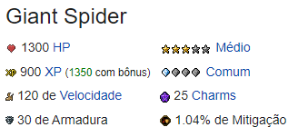
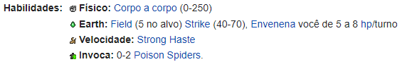
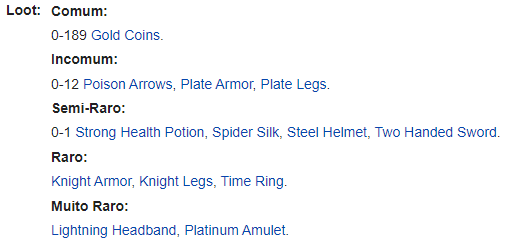
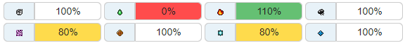

# Implementação Prática II - Criando a Classe Criatura

Agora que já foi apresentado com mais detalhes os conceitos de POO, vamos criar a classe **Criatura**. Essa classe será responsável por criar os criaturas que o jogador irá enfrentar durante o jogo.

A partir da página de qualquer criatura no Tibia Wiki, podemos obter algumas informações de quais serão os atributos da classe **Criatura**. 

Nessa implementação prática, vamos replicar a temida **Giant Spider**. 

Acessando sua página no [Tibia Wiki](https://www.tibiawiki.com.br/wiki/Giant_Spider) podemos ver que ela possui os seguintes atributos básicos:



Assim como informações sobre suas **vulnerabilidades**, **imunidades**, **habilidades** e **loot**.

Portanto a nossa classe **Criatura** completa terá os seguintes atributos:

- `nome`: Nome da criatura.
- `hp`: Quantidade de vida da criatura.
- `dificuldade`: Dificuldade da criatura.
- `exp`: Quantidade de experiência que o jogador ganha ao derrotar a criatura.
- `ocorrencia`: Probabilidade da criatura aparecer durante o jogo.
- `velocidade`: Velocidade de movimento da criatura.
- `armadura`: Armadura da criatura.
- `mitigacao`: Mitigação de dano da criatura.
- `habilidades`: Habilidades que a criatura pode usar durante o combate e seus respectivos efeitos.
- `loot`: Loot que a criatura pode dropar ao ser derrotado e suas respectivas probabilidades.
- `vulnerabilidades`: Vulnerabilidades da criatura a determinados tipos de dano.
- `imunidades`: Imunidades da criatura a certos efeitos.
- `pode_ser_puxado`: Indica se a criatura pode ser puxado pelo jogador.
- `empurra_objetos`: Indica se o criatura pode empurrar objetos.
- `passa_por`: Indica se o criatura pode passar por alguns tipos de campos.
  

## Criando a classe Criatura

Antes de criar a classe **Criatura**, vamos criar as classes **Habilidade**, **Loot** e **Vulnerabilidades**. Essas classes serão usadas para criar os atributos `habilidades`, `loot` e `vulnerabilidades` da classe **Criatura**.

### Criando a classe Habilidade

Vamos analisar as habilidades da **Giant Spider**, e abstrair os atributos que serão necessários para criar a classe **Habilidade**.



A classe **Habilidade** terá os seguintes atributos:

- `nome`: Nome da habilidade.
- `efeito`: Efeito da habilidade.
- `tipo`: Tipo da habilidade.
- `dano`: Dano da habilidade.
- `dano_por_turno`: Dano por turno da habilidade.
- `cura`: Cura da habilidade. 
- `cura_por_turno`: Cura por turno da habilidade.
- `sumonar`: Criatura que a habilidade pode sumonar.
- `sumonar_quantidade`: Quantidade de criaturas que a habilidade pode sumonar.

*(Alguns criaturas possuem habilidades de cura ou summon)*

A classe **Habilidade** completa ficará da seguinte forma:

```python
import time

from typing import Optional
from random import randint

from classes.Criatura import Criatura


class Habilidade:
    def __init__(
        self,
        nome: str,
        efeito: str,
        classe: str,
        dano_min: Optional[int] = None,
        dano_max: Optional[int] = None,
        dano_dot: Optional[int] = None,
        duracao_dot: Optional[int] = None,
        cura: Optional[int] = None,
        velocidade: Optional[int] = None,
        summon: Optional[Criatura] = None,
        summon_quantidade: Optional[int] = None,
    ):
        self.nome = nome
        self.efeito = efeito
        self.classe = classe
        self.dano_min = dano_min
        self.dano_max = dano_max
        self.dano_dot = dano_dot
        self.duracao_dot = duracao_dot
        self.cura = cura
        self.velocidade = velocidade
        self.summon = summon
        self.summon_quantidade = summon_quantidade

    def curar(self, alvo):
        alvo.hp += self.cura
        print(f"{alvo.nome} foi curado em {self.cura} pontos de vida.")

    def atacar(self, alvo):
        dano = randint(self.dano_min, self.dano_max)
        alvo.hp -= dano
        print(f"{alvo.nome} recebeu {dano} pontos de dano.")

    def ataque_dot(self, alvo):
        alvo.hp -= self.dano_dot
        time.sleep(2)
        print(f"{alvo.nome} recebeu {self.dano_dot} pontos de dano.")
        self.duracao_dot -= 2
        if self.duracao_dot == 0:
            print(f"O efeito de {self.nome} acabou.")
        return
    
    def aumentar_velocidade(self, alvo):
        alvo.velocidade += self.velocidade + (self.velocidade * 0.7 - 28)
        print(f"{alvo.nome} teve sua velocidade aumentada.")

    def invocar_criaturas(self):
        minions = []
        for _ in range(self.summon_quantidade):
            minions.append(self.summon)
        print(f"{self.summon_quantidade} {self.summon} foram invocados.")
        return minions

    def __str__(self):
        return self.nome
```

### Criando a classe Loot

Vamos analisar como os loots da **Giant Spider** são apresentados no Tibia Wiki.



A partir da imagem acima, podemos criar classe **Loot** com os seguintes atributos:

- `nome`: Nome do loot.
- `quantidade`: Quantidade do loot.
- `chance`: Chance do loot ser dropado.

A classe **Loot** completa ficará da seguinte forma:

```python
class Loot:
    def __init__(self, nome: str, quantidade: int, chance: float):
        self.nome = nome
        self.quantidade = quantidade
        self.chance = chance

    
    def __str__(self):
        return self.nome
```

### Criando a classe Vulnerabilidades

Os criaturas do Tibia possuem resistências a determinados tipos de dano. Vamos analisar as resistências da **Giant Spider**.



A classe **Vulnerabilidades** terá os seguintes atributos:

- `fisico`: Porcentagem de dano físico recebido.
- `fogo`: Porcentagem de dano de fogo recebido.
- `gelo`: Porcentagem de dano de gelo recebido.
- `morte`: Porcentagem de dano de morte recebido.
- `energia`: Porcentagem de dano de energia recebido.
- `sagrado`: Porcentagem de dano sagrado recebido.
- `terra`: Porcentagem de dano de terra recebido.
- `cura`: Porcentagem de cura recebida.

A classe **Vulnerabilidades** completa ficará da seguinte forma:

```python
class Vulnerabilidade:
    def __init__(self, fisico: int, fogo: int, gelo: int, morte: int, energia: int, sagrado: int, terra: int, cura: int):
        self.fisico = fisico
        self.fogo = fogo
        self.gelo = gelo
        self.morte = morte
        self.energia = energia
        self.sagrado = sagrado
        self.terra = terra
        self.cura = cura
```

Agora que já criamos as classes **Habilidade**, **Loot** e **Resistencia**, podemos criar a classe **Criatura** e atribuir os tipos de dados para cada atributo.

### Criando a classe Criatura

```python
from classes.Habilidade import Habilidade
from classes.Loot import Loot
from classes.Resistencia import Resistencia


class Criatura:
    def __init__(self, nome:, hp, dificuldade, exp, ocorrencia, velocidade, armadura, mitigacao, habilidades, loot, vulnerabilidades, imunidades, pode_ser_puxado, empurra_objetos, passa_por):
        self.nome = nome | str
        self.hp = hp
        self.dificuldade = dificuldade
        self.exp = exp
        self.ocorrencia = ocorrencia
        self.velocidade = velocidade
        self.armadura = armadura
        self.mitigacao = mitigacao
        self.habilidades = habilidades
        self.loot = loot
        self.vulnerabilidades = vulnerabilidades
        self.imunidades = imunidades
        self.pode_ser_puxado = pode_ser_puxado
        self.empurra_objetos = empurra_objetos
        self.passa_por = passa_por

    
    def __str__(self):
        return self.nome
```
```